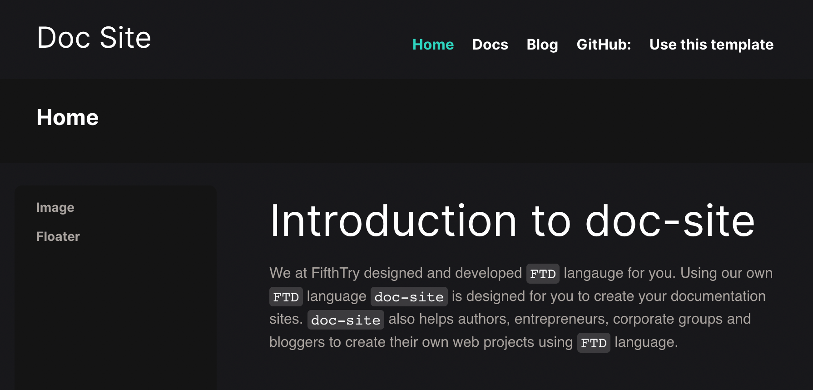

# Welcome to your [FPM site](https://fpm.dev/)

FPM Blank Package Template Repo

[Deploy using FifthTry (fastn.io)](https://fastn.io/deploy/?git-repo=heulitig/testing-debug-cat)

[Deploy using FifthTry (controller-service)](https://fifthtry.com/hosting/deploy/?git-repo=heulitig/testing-debug-cat)

[](https://127.0.0.1:8000/deploy/?git-repo=heulitig/testing-debug-cat)

> 🧑‍🚀 **Seasoned traveler?** update this file. Enjoy!




## 🚀 Project Structure

Inside of your FPM project, you'll see the following folders and files:

```
/
├── .build/
│   └── index.html
├── .packages/
│   └── fifthtry.github.io/
│   	└── All downloaded dependencies
│   	
├── FPM.ftd
├── index.ftd
└── README.md
```

## 🧞 Commands

All commands are run from the root of the project, from a terminal:

| Command                | Action                                             |
| :--------------------- | :------------------------------------------------- |
| `fpm build`            | FPM builder installs all `FPM` dependencies        |
| `fpm serve`            | Starts local dev server at available port`localhost:8000`          |


## 👀 Want to learn more?

Feel free to check [our documentation](https://fpm.dev/) or jump into our [FifthTry Discord server](https://discord.gg/bucrdvptYd).
